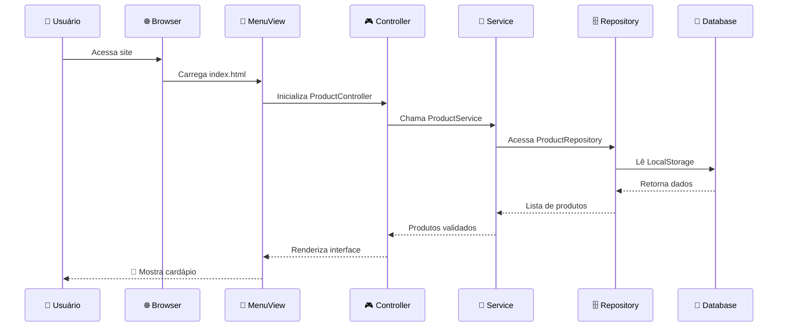
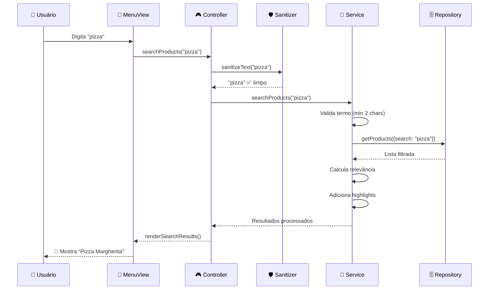
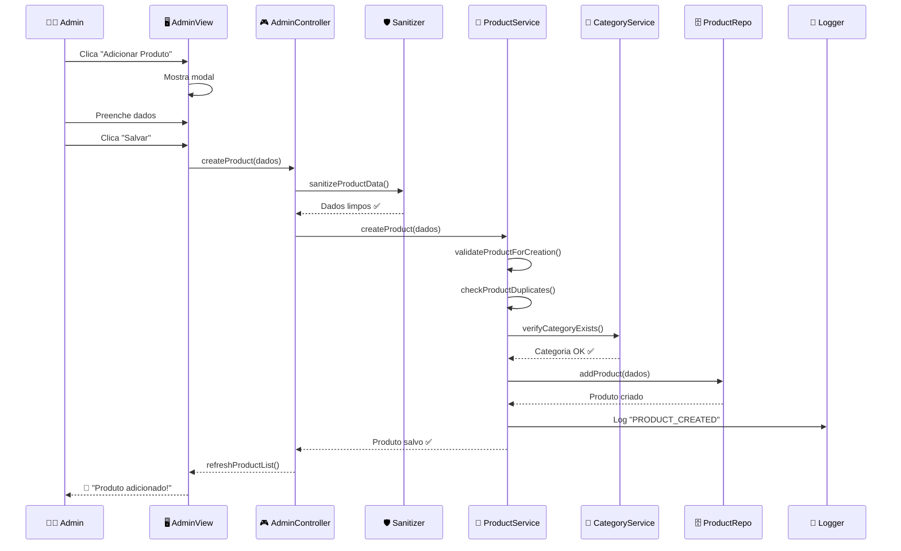
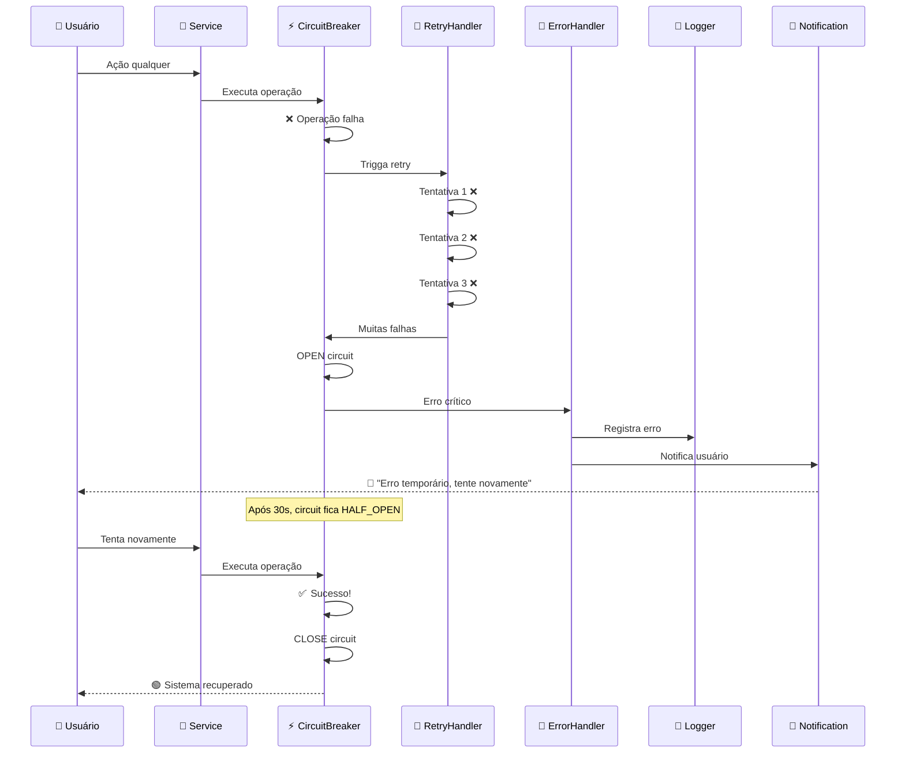
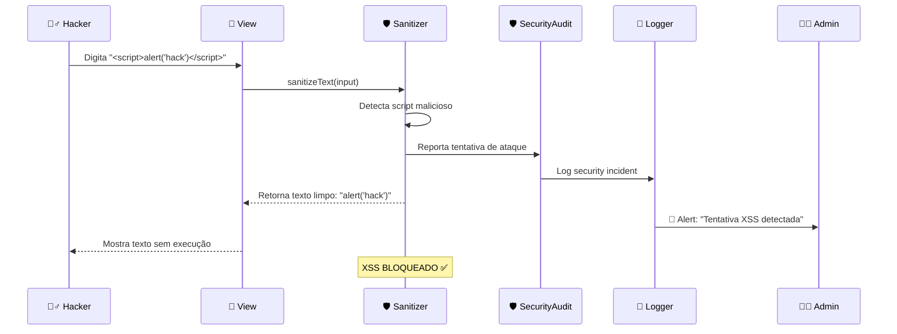

# 🎬 FLUXO DE AÇÕES - MENU ONLINE

## 📱 CENÁRIO 1: CLIENTE ACESSA CARDÁPIO



## 🔍 CENÁRIO 2: BUSCA DE PRODUTOS



## 👨‍💼 CENÁRIO 3: ADMIN ADICIONA PRODUTO



## ❌ CENÁRIO 4: ERRO E RECUPERAÇÃO



## 🔐 CENÁRIO 5: ATAQUE XSS BLOQUEADO



## 🏗️ ARQUITETURA EM CAMADAS

```
🎨 APRESENTAÇÃO    │ Como o usuário vê e interage
├─ MenuView.js     │ Cardápio bonito para clientes
├─ AdminView.js    │ Interface limpa para administração
└─ Layout/CSS      │ Design responsivo e moderno

🎮 CONTROLE        │ Coordena ações do usuário
├─ ProductController │ "Usuário quer ver produtos"
├─ AdminController   │ "Admin quer gerenciar"
└─ Routing          │ "Vai para página correta"

💼 NEGÓCIO         │ Regras importantes da empresa
├─ ProductService  │ "Produto deve ter preço válido"
├─ CategoryService │ "Categoria não pode estar vazia"
└─ Validation      │ "Dados devem estar corretos"

🗄️ DADOS           │ Onde as informações ficam guardadas
├─ ProductRepository │ "CRUD de produtos"
├─ CategoryRepository│ "CRUD de categorias"
└─ LocalStorage     │ "Banco de dados do browser"

🛡️ SEGURANÇA       │ Protege contra ataques
├─ InputSanitizer  │ "Remove códigos maliciosos"
├─ SecurityAudit   │ "Monitora tentativas de hack"
└─ PasswordManager │ "Senhas com hash seguro"

⚡ INFRAESTRUTURA   │ Sistemas que nunca param
├─ ErrorHandler    │ "Captura erros antes de quebrar"
├─ CircuitBreaker  │ "Para cascata de falhas"
├─ RetryHandler    │ "Tenta novamente se falhar"
├─ Logger          │ "Registra tudo que acontece"
└─ HealthCheck     │ "Verifica se tudo está OK"
```

## 🚀 MOMENTOS DE USO REAL

### 🌅 **MANHÃ - ABERTURA DO RESTAURANTE**
```
08:00 - Admin abre sistema
      ↓
📊 HealthCheck verifica se tudo OK
📝 Logger registra: "Sistema iniciado"
🛡️ SecurityAudit ativo
⚡ CircuitBreakers em CLOSED (funcionando)
      ↓
✅ Sistema pronto para o dia
```

### 🍽️ **HORÁRIO DE ALMOÇO - PICO DE CLIENTES**
```
12:00-14:00 - Muitos acessos simultâneos
      ↓
📱 MenuView renderiza cardápio 100x/min
🔍 Buscas: "pizza", "hambúrguer", "salada"
🛡️ InputSanitizer limpa TODOS os inputs
📝 Logger registra cada busca
⚡ CircuitBreaker protege contra sobrecarga
      ↓
🎯 Todos os clientes veem cardápio instantaneamente
```

### 🌃 **NOITE - ATUALIZAÇÃO DO CARDÁPIO**
```
20:00 - Admin atualiza preços e produtos
      ↓
👨‍💼 AdminController processa mudanças
💼 ProductService valida todos os dados
🗄️ Repository salva no LocalStorage
📝 Logger registra: "15 produtos atualizados"
🛡️ SecurityAudit monitora operações
      ↓
✅ Cardápio atualizado para o próximo dia
```

### 🚨 **SITUAÇÃO DE EMERGÊNCIA - ERRO DE REDE**
```
Conexão instável causa falhas
      ↓
❌ ProductRepository falha 3x seguidas
⚡ CircuitBreaker abre (OPEN)
🔄 RetryHandler para de tentar
🚨 ErrorHandler captura situação
📢 NotificationService avisa usuário
📝 Logger registra incidente
      ↓
🔄 Após 30s, tenta novamente
✅ Conexão volta, sistema recupera
⚡ CircuitBreaker fecha (CLOSED)
```

## 🎯 **RESUMO: CADA PARTE TEM SEU MOMENTO**

| **Quando acontece** | **O que é usado** | **Para que serve** |
|---------------------|-------------------|-------------------|
| **Todo acesso** | ErrorHandler, Logger | Garantir que nada quebra |
| **Usuário digita** | InputSanitizer | Evitar ataques XSS |
| **Busca produtos** | ProductService, Repository | Encontrar o que cliente quer |
| **Admin gerencia** | AdminController, Services | Manter cardápio atualizado |
| **Sistema falha** | CircuitBreaker, RetryHandler | Recuperar automaticamente |
| **Operação crítica** | Logger, SecurityAudit | Rastrear e auditar tudo |

**🎊 RESULTADO: Sistema que funciona 24/7 sem supervisão!**